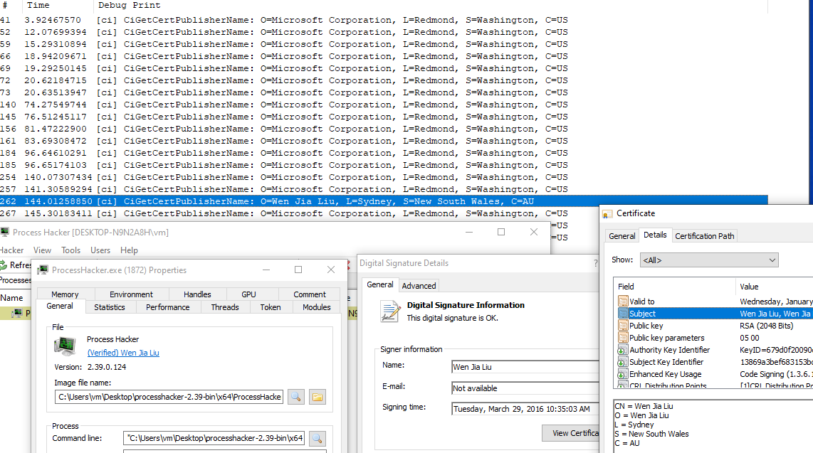

# CiGetCertPublisherName

An example code of CiGetCertPublisherName

# References

This repository contains some structure definition researched by:

- https://github.com/Ido-Moshe-Github/CiDllDemo
